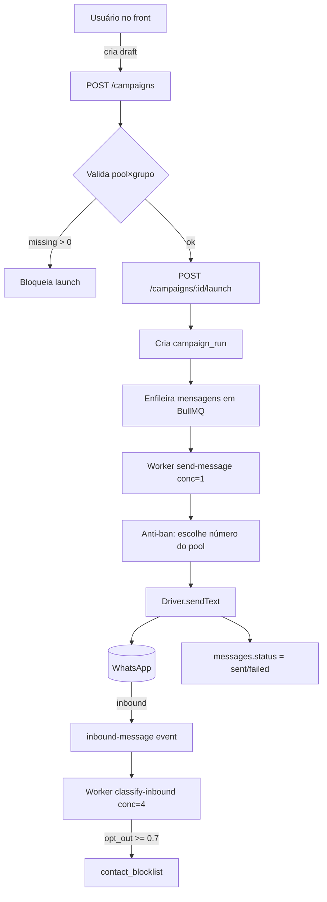

# Visão Geral

Voltar para [[BulkZap]].

O BulkZap é um monorepo Bun + Turborepo com dois apps (`api` e `web`) e três packages compartilhados. A API ElysiaJS expõe REST + WebSocket, processa trabalho assíncrono via BullMQ/Redis, e mantém conexões WhatsApp vivas em memória através do [[Account Manager]]. O front Next.js consome a API e renderiza QR, campanhas e relatórios.

## Estrutura do repositório

```
bulk-zap/
├── apps/
│   ├── api/          # Elysia: drivers, jobs, routes, services, admin
│   └── web/          # Next.js: app router, components/ui, components, lib
├── packages/
│   ├── db/           # Drizzle schema + migrations (autoridade do banco)
│   ├── eslint-config/
│   └── typescript-config/
├── docker-compose.yml    # APENAS Postgres em dev
├── ecosystem.config.js   # PM2 para prod
└── .env.example
```

## Fluxo de dados de um disparo



Detalhes em [[Jobs e Filas]], [[Sistema Anti-ban]] e [[Features de IA]].

## Componentes em runtime

| Componente | Responsabilidade | Nota |
|---|---|---|
| Elysia HTTP/WS | REST + WebSocket de QR | porta `API_PORT` (3000 dev) |
| [[Account Manager]] | `Map<accountId, driver>` vivo entre requests | singleton em memória |
| Workers BullMQ | envio, warmup, classificação | ver [[Jobs e Filas]] |
| Bull Board | painel de filas em `/admin/queues` | Hono adapter + basic auth |
| Redis | fila + cache de IA + rate limit | `appendonly yes` em prod |
| Postgres | toda persistência, inclusive sessões Baileys | ver [[Schema do Banco]] |

## Ambientes

- **Dev**: Postgres em Docker, Redis via brew, apps via `bun run dev` (Turborepo).
- **Prod**: 1 EC2, **sem Docker** — Postgres e Redis nativos (`apt install`), apps via PM2 (`ecosystem.config.js`).

> [!warning] Não containerize a produção
> O cliente escolheu apps nativos na EC2. Postgres e Redis via `apt`, apps via `pm2 start ecosystem.config.js`. Docker em dev é só para o Postgres.

Veja também [[Stack]] e [[Decisões de Arquitetura]].
